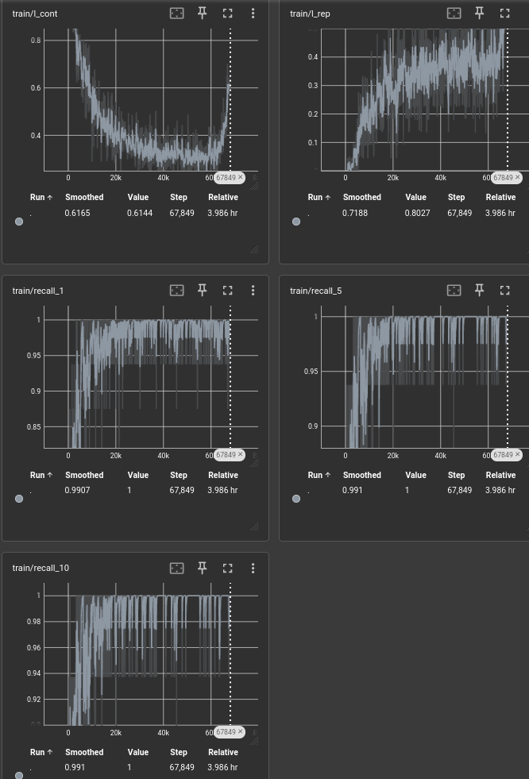
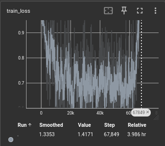
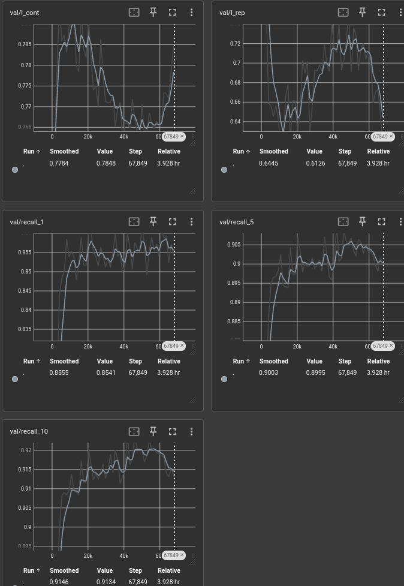
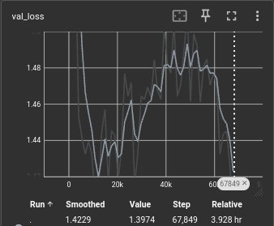
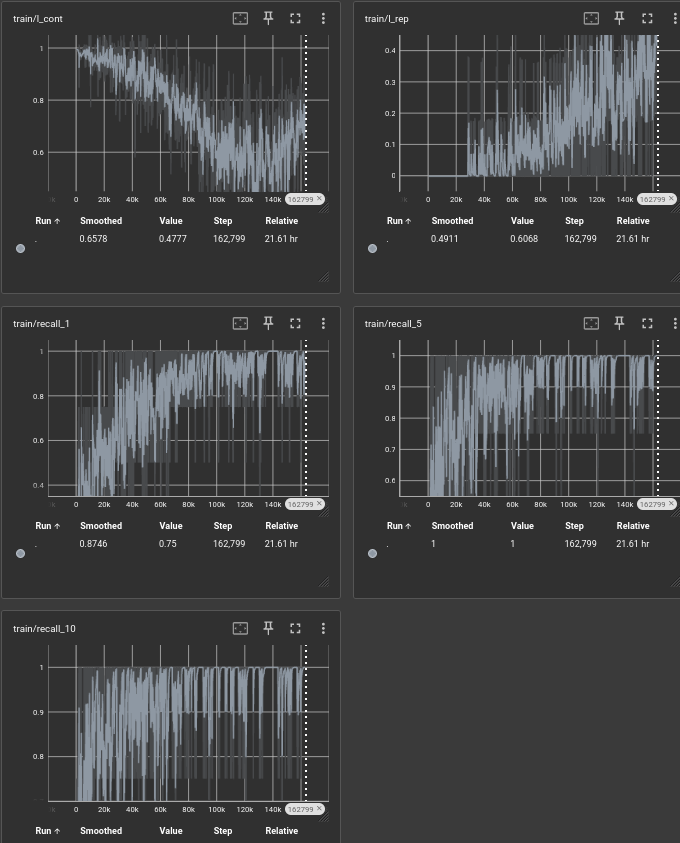
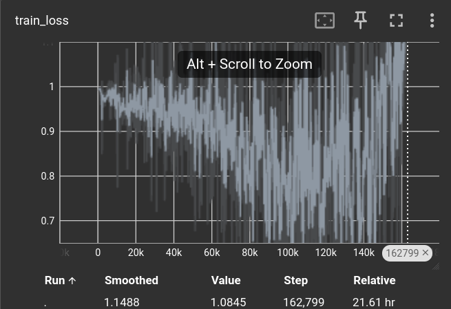
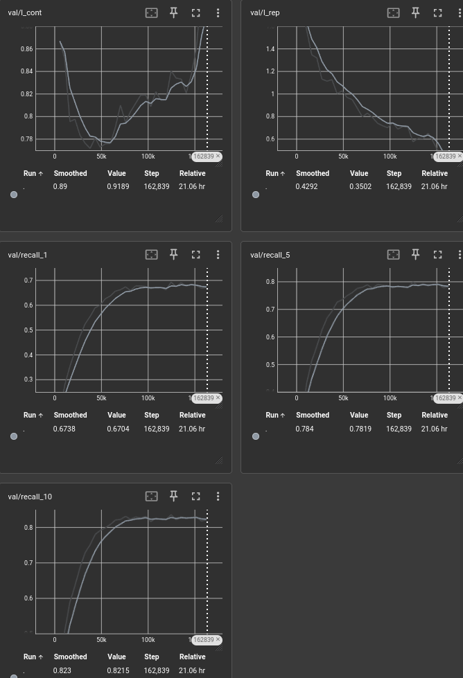
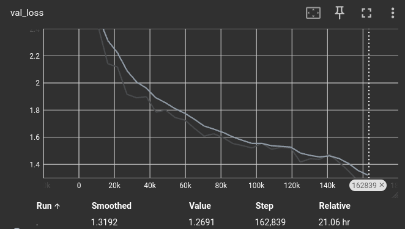
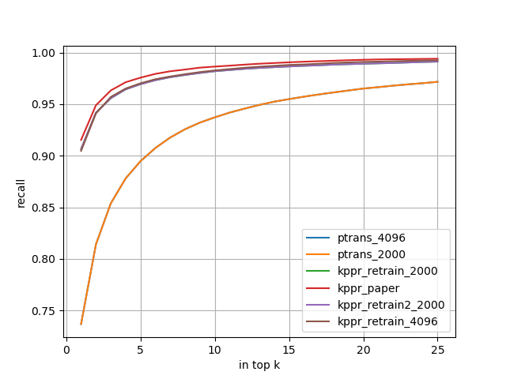

# KPPR: Exploiting Momentum Contrast for Point Cloud-Based Place Recognition

## Installation

+ note that the version of pytorch should higher than 1.7.1, cause the pytorch_lightning requires higher version of pytorch (1.13.1 and 2.0.1 are ok)
+ pointnet_ops_lib should be adjusted to be installed at CUDA 11.* FOR __point transformer backbone__

1. Install all requirements: `pip install -r requirements.txt`
2. Install this repository: `pip install -e .`

## Usage

### Training

All the following commands should be run in `kppr/`

- Please update the config files (especially the `oxford_data.yaml` to match your data_dir)
- Run the training: `python train.py`
- The output will be saved in `kppr/experiments/{EXPERIMENT_ID}`

> or direct run the bash file with 'bash run.sh'

### Testing

- Test the model by running: `python test.py --checkpoint {PATH/TO/CHECKPOINT.ckpt} --dataset {DATASET} --base_dir {PATH/TO/DATA}`, where `{DATASET}` is e.g. `oxford`
- The output will be saved in the same folder as the checkpoint
- All the results can be visualized with: `python scripts/vis_results.py`
- The numbers of the paper are in `experiments/kppr/.../oxford_evaluation_query.txt`
- The pre-trained model can be downloaded [here](https://www.ipb.uni-bonn.de/html/projects/kppr/kppr.ckpt) and should be placed into `experiments/kppr/lightning_logs/version_0/`.

## Data

- The pre-compressed point cloud maps can be downloaded [here](https://www.ipb.uni-bonn.de/html/projects/retriever/oxford_compressed.zip) and should be extracted to `data/` (or simply put a symbolic link).
- For the uncompressed point clouds, I refer to [PointNetVLAD](https://github.com/mikacuy/pointnetvlad).

## Practical test

### The model used inside paper

#### The total parameters

```
   | Name             | Type                   | Params
-------------------------------------------------------------
0  | pnloss           | EntropyContrastiveLoss | 0     
1  | q_model          | KPPRNet                | 11.5 M
2  | q_model.pn       | PointNetFeat           | 852 K 
3  | q_model.conv     | ConvNet                | 6.4 M 
4  | q_model.aggr     | VladNet                | 4.2 M 
5  | k_model          | KPPRNet                | 11.5 M
6  | k_model.pn       | PointNetFeat           | 852 K 
7  | k_model.conv     | ConvNet                | 6.4 M 
8  | k_model.aggr     | VladNet                | 4.2 M 
9  | feature_bank     | FeatureBank            | 0     
10 | feature_bank_val | FeatureBank            | 0     
-------------------------------------------------------------
11.5 M    Trainable params
11.5 M    Non-trainable params
23.0 M    Total params
92.082    Total estimated model params size (MB)
```

#### The visualization curve

trainset recall:


trainset loss:


valset recall:


valset loss:



### A new Point Transformer based backbone

#### The total parameters

```
  | Name               | Type                   | Params
--------------------------------------------------------------
0 | pnloss             | EntropyContrastiveLoss | 0     
1 | q_model            | PointTransformerNet    | 22.0 M
2 | q_model.pc_encoder | PointTransformer       | 21.9 M
3 | q_model.pc_proj    | Linear                 | 98.6 K
4 | k_model            | PointTransformerNet    | 22.0 M
5 | k_model.pc_encoder | PointTransformer       | 21.9 M
6 | k_model.pc_proj    | Linear                 | 98.6 K
7 | feature_bank       | FeatureBank            | 0     
8 | feature_bank_val   | FeatureBank            | 0     
--------------------------------------------------------------
22.0 M    Trainable params
22.0 M    Non-trainable params
43.9 M    Total params
87.826    Total estimated model params size (MB)
```

#### The visualization curve

trainset recall:


trainset loss:


valset recall:


valset loss:


#### Analysis

+ The training process is time-consuming, which takes almost 21hours for 30 epoches.
+ However, the performance of the Transformer-based model is much inferior, while introduces quite larger computational complexity and the inference time increases.
+ Both models exist the over-fitting phenomenon.
+ for compressed data, the pts number should be 2000, 4096 will decrease the recall

+ recall curve



## Notions

The number of positives are not identical, e.g. for query index=3, there are 72 positives inside the 25m radius range, and the final positives are selected based on shuffle operation and desired number of positives.

+ do not change the name of the loggings, e.g. `version_4` to `version_xxxx`, which will crash the pytorch_lighting to find the proper dir automatically.

## Citation

If you use this library for any academic work, please cite the original paper.

```bibtex
@article{wiesmann2023ral,
author = {L. Wiesmann and L. Nunes and J. Behley and C. Stachniss},
title = {{KPPR: Exploiting Momentum Contrast for Point Cloud-Based Place Recognition}},
journal = ral,
volume = {8},
number = {2},
pages = {592-599},
year = 2023,
issn = {2377-3766},
doi = {10.1109/LRA.2022.3228174},
}
```
